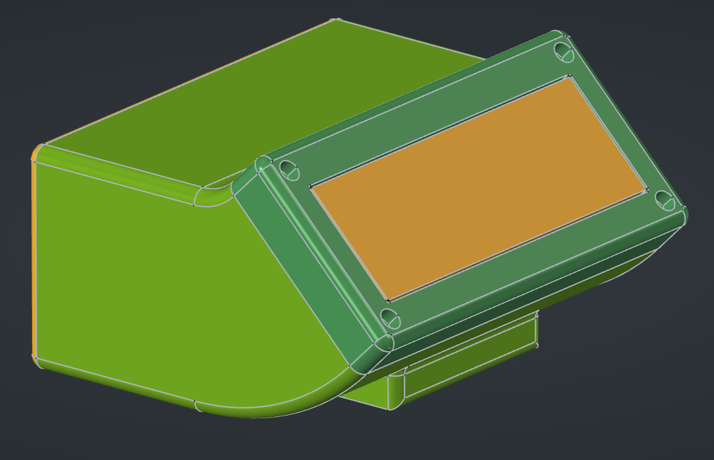
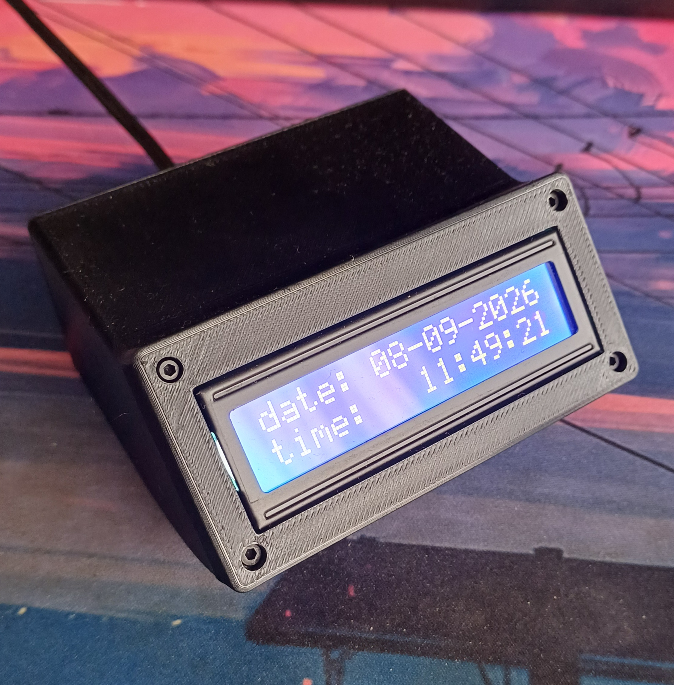

# ESP32 NTP Clock

An ESP32 based clock with a 16x2 I2C LCD, that gets time from an NTP server over WiFi.

Uses `WiFiManager` to securely connect to WiFi.

It has a 3D printed housing designed in FreeCad.

## Images

Model of the clock designed in FreeCad

The clock itself, with a 3D printed housing

